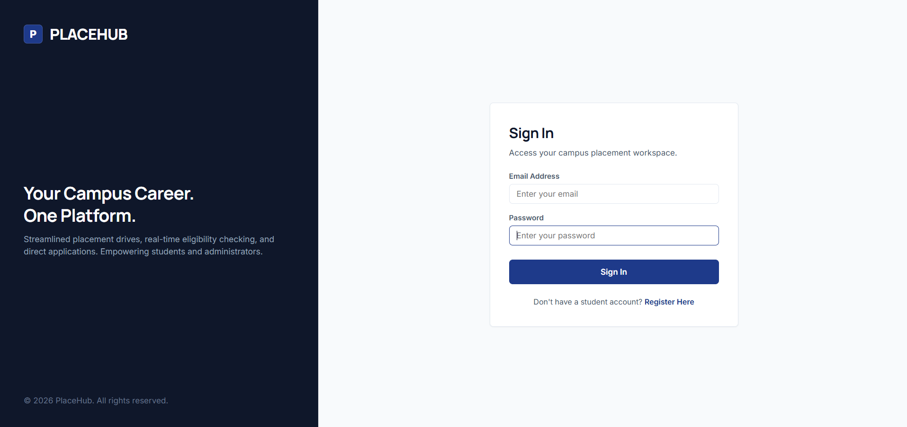
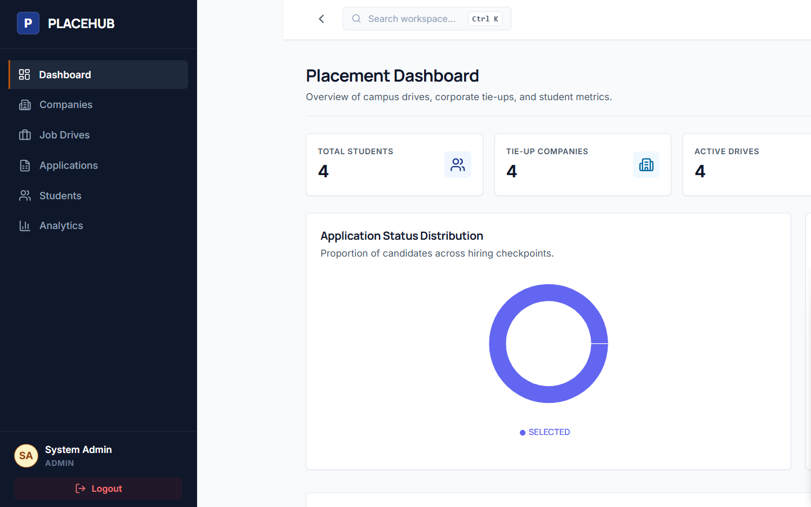
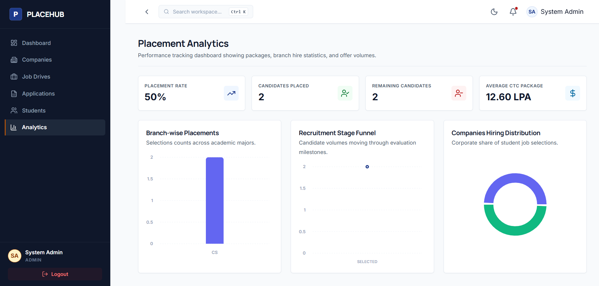

# PlaceHub - Campus Placement Management System

PlaceHub is a web portal designed for colleges to manage student placement drives, recruiter company registrations, and job applications. The platform automates academic eligibility checks, allowing students to check if they meet specific criteria (CGPA, backlogs, branch, graduation year) before applying, while giving administrators central dashboards to manage drives and track candidate progress.

## Features

- **Automated Eligibility Verification**: Validates student profile statistics (CGPA, active backlogs, branch cohort) against job drive criteria in real time.
- **Recruitment Timeline Tracker**: Displays status progress for students through application milestones (Applied, Assessment, Interviews, Selected/Rejected).
- **Admin Dashboard**: Central panel for company profile CRUD operations, configuring placement drives, and updating candidate hiring stages.
- **Placement Analytics**: Interactive Recharts layouts displaying branch placements, average packages, and stage funnel reports.
- **Theme Customization**: Responsive dark and light mode persistent across user sessions.

## Tech Stack

- **Frontend**: React (Vite), React Router, Framer Motion (transitions), Recharts (data charts), React Hot Toast (toasts), Lucide React (icons), CSS Variables.
- **Backend**: Java 17, Spring Boot, Spring Security (JWT-based session authentication), Hibernate / Spring Data JPA.
- **Database**: MySQL.

## Screenshots

### Login Page



### Student Dashboard



### Admin Dashboard




## Installation

### Prerequisites
- Java 17 JDK
- Node.js (v18+)
- MySQL Server (running on port `3306` or `3307`)

### Database Setup
1. Log in to your local MySQL instance.
2. Create a database schema named `placehub_db`:
   ```sql
   CREATE DATABASE placehub_db;
   ```

### Backend Setup
1. Open a terminal in the `backend/` directory.
2. Configure your database URL and credentials in `src/main/resources/application.properties` (or set the environment variables listed in the configuration section).
3. Build and run the Spring Boot server:
   ```bash
   mvn spring-boot:run
   ```
   *Note: On startup, the application seeds mock admin accounts, companies (Google, Microsoft, Amazon), and initial drives if the database tables are empty.*
4. The server runs at `http://localhost:8080`. API documentation is available at `http://localhost:8080/swagger-ui/index.html`.

### Frontend Setup
1. Open a terminal in the `frontend/` directory.
2. Install the node packages:
   ```bash
   npm install
   ```
3. Start the dev server:
   ```bash
   npm run dev
   ```
4. The client application runs at `http://localhost:5173`.

---

## API Overview

The backend exposes REST endpoints under the `/api` namespace:

- `/api/auth/*` - Handles student registration and credentials verification.
- `/api/students/*` - Retrieves and updates academic statistics (CGPA, backlogs, skills tags).
- `/api/jobs/*` - Lists active drives, criteria, and filters eligible positions for the current student.
- `/api/applications/*` - Submits fresh applications (triggers eligibility evaluation) and lists student entries.
- `/api/admin/*` - Administrator endpoints for companies, drives, candidates review, and analytics stats.

---

## Folder Structure

```text
backend/           # Java Spring Boot REST application
frontend/          # React SPA frontend client application
docker-compose.yml # Dev environment compose wrapper
README.md
```

---

## Configuration

The backend reads configuration settings from environment variables:

| Variable | Description | Default |
|----------|-------------|---------|
| `DB_URL` | JDBC Database Connection URL | `jdbc:mysql://localhost:3306/placehub_db` |
| `DB_USERNAME` | Database connection username | `root` |
| `DB_PASSWORD` | Database connection password | *(empty)* |
| `JWT_SECRET` | Secret key used to sign Auth tokens | `placehub-dev-secret-key-change-me-in-production` |

---

## Demo Accounts

### Administrator Hub
- **Email:** `admin@placehub.com`
- **Password:** `admin123`

### Student Dashboard
- **Email:** `rohit@placehub.com`
- **Password:** `student123`

---

## Future Improvements

- Add email notifications when a candidate's application status is transitioned by an admin.
- Integrate PDF resume parsing to automatically pre-fill student profile statistics.
- Export placement charts and hiring spreadsheets to Excel/CSV formats.

## License

This project is licensed under the MIT License.
